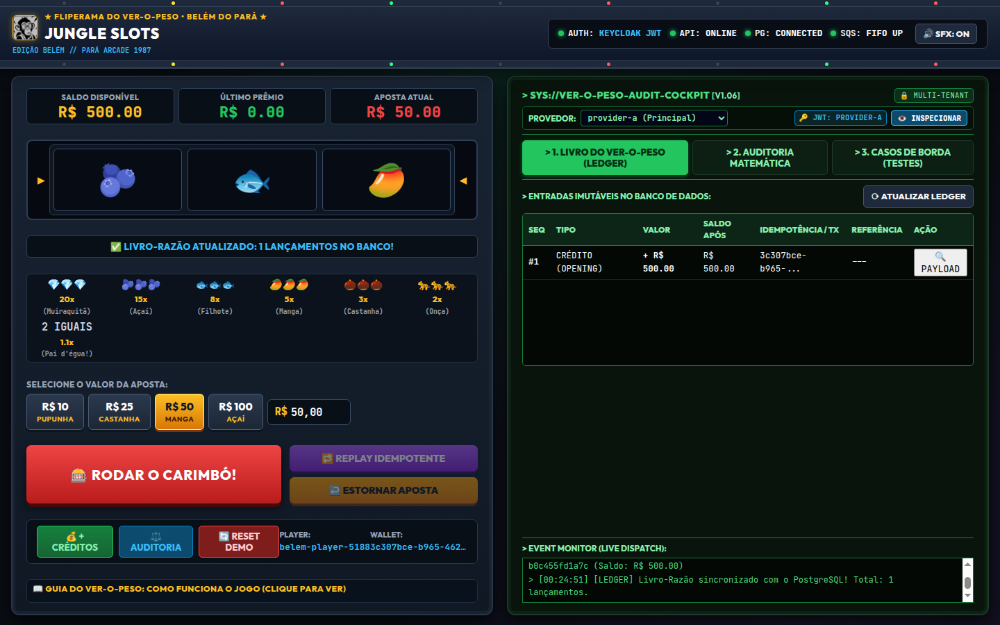
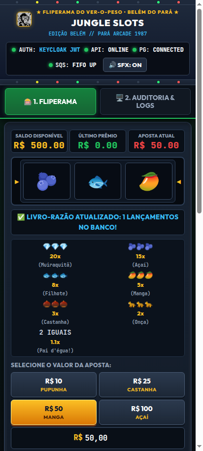

# 🎲 Desafio Backend — Processamento Distribuído de Apostas em Go

> ### 🏆 Desafio Técnico — Jungle Gaming (Backend Developer - Go)
> Este projeto consiste na resolução prática do desafio técnico para a vaga de **Backend Developer - Go** na [Jungle Gaming](https://junglegaming.io/pt), recebido após aprovação na etapa de entrevista técnica via comunicado oficial de Alison Dias (`alisondias@team.junglegaming.io`) em 14 de setembro de 2026.
> 
> - **Repositório Oficial do Desafio:** [junglegaming/backend-challenge-go](https://github.com/junglegaming/backend-challenge-go)
> - **Candidato:** Lucivaldo Junior
> - **Prazo de Conclusão:** 3 dias
> - **Stack Tecnológica:** Go 1.26.4, Uber Fx, PostgreSQL 16 (ACID, Row-Level Locking e Triggers de Imutabilidade), AWS SQS FIFO (LocalStack com DLQ e Deduplicação), Keycloak 24 (OIDC OAuth 2.0 / RS256 JWKS), WebAssembly (Go WASM) e Web Cockpit Retrô.

Serviço financeiro concorrente e distribuído para processamento de apostas de provedores de jogos (*iGaming / Sportsbook*). Desenvolvido em **Go 1.26.4**, composto com **Uber Fx**, com persistência relacional ACID em **PostgreSQL 16**, mensageria assíncrona **AWS SQS FIFO** via **LocalStack**, e autenticação OIDC via **Keycloak**.

---

## 🚀 1. Pré-requisitos

- **Go:** versão `1.26.4` (necessária para executar a API ou os testes fora do Docker)
- **Docker & Docker Compose:** Docker 24+ com Compose v2+
- **Utilidades de linha de comando:** `curl` e `jq` (opcionais, mas usados nos exemplos)

## ⚡ Início rápido — caminho recomendado

> Antes de começar, confirme que Docker e Docker Compose estão instalados, que
> há acesso à internet no primeiro build para baixar as imagens e que as portas
> locais `5432`, `4566`, `8000` e `8080` estão livres. Elas são usadas,
> respectivamente, por PostgreSQL, LocalStack, API e Keycloak.

### ⚠️ Pontos de Atenção Cruciais para Execução em Qualquer Máquina

Para garantir que o projeto execute do absoluto zero em qualquer sistema (Linux, macOS ou Windows/WSL2) sem nenhum conflito:

1. **Conflito de Portas no Host:**
   - O projeto expõe 4 portas no sistema host: `8000` (API), `5432` (PostgreSQL), `8080` (Keycloak) e `4566` (LocalStack).
   - **PostgreSQL Local:** Se a sua máquina já possui uma instância local do PostgreSQL ativa na porta `5432`, pause o serviço antes de subir os containers (ex: `sudo systemctl stop postgresql` no Linux ou `brew services stop postgresql` no Mac) para evitar o erro `bind: address already in use`.
2. **Zero Configuração Manual (Tudo Automatizado no Boot):**
   - **Migrations do Banco:** São aplicadas automaticamente no boot da aplicação a partir de `migrations/000001_init_schema.up.sql`. Não é necessário criar tabelas ou rodar queries manuais.
   - **Realm & Clientes OIDC:** O Keycloak inicializa com a flag `--import-realm` lendo `keycloak/realm-export.json`. Usuários, secrets e clientes (`internal-service`, `provider-a`, `provider-b`) já sobem prontos.
   - **Filas SQS FIFO:** O LocalStack cria as filas (`.fifo`) e a DLQ automaticamente no boot através do script `localstack/init-sqs.sh`.
3. **Bateria Completa de Testes E2E em 10 Segundos:**
   - Execute o script `./scripts/test_e2e.sh` para rodar todos os **21 cenários de teste ponta a ponta**.
   - O script é **independente de ferramentas na máquina host**: não exige `aws-cli` instalado (ele utiliza fallback inteligente com `awslocal` direto no container do LocalStack). Apenas requer `curl`, `jq` e `docker`.
4. **Guia Didático e Cenários de Borda:**
   - Consulte o documento detalhado [`GUIA_DE_TESTES_E_CENARIOS.md`](GUIA_DE_TESTES_E_CENARIOS.md) para entender os fundamentos técnicos de cada teste (concorrência `SELECT ... FOR UPDATE`, triggers PL/pgSQL de imutabilidade, tokens JWT RS256 e resiliência fora de ordem).

Após clonar o repositório, execute:

```bash
git clone https://github.com/luci-jr/desafio-jungle-game.git
cd desafio-jungle-game
docker compose up --build -d
```

Espere a API e suas dependências ficarem disponíveis:

```bash
until curl -fsS http://localhost:8000/health/ready; do sleep 2; done
```

O último comando deve retornar o status `UP`. A API estará disponível em
`http://localhost:8000`. Consulte a interface interativa na seção 2 e as chamadas autenticadas na seção 8.

---

## 🎮 2. Jungle Slots 1987 — Cockpit Arcade & Simulador Visual da Engine

Para além da bateria de testes via terminal e Postman, este projeto inclui uma **interface visual completa de cockpit e simulador de apostas** embutida nativamente no binário Go, acessível tanto localmente quanto na nuvem para exibição de portfólio:

👉 **Demonstração Online na Vercel (Portfólio Interativo):** [https://jungle-slots-1987.vercel.app](https://jungle-slots-1987.vercel.app) *(com motor WebAssembly, sons 8-bit, simulação de ledger e idempotência in-browser)*  
🖥️ **URL de Acesso Local (Docker / Go Engine Completa):** [http://localhost:8000/app/](http://localhost:8000/app/) *(ou simplesmente `http://localhost:8000/`, que redireciona automaticamente)*  
📱 **URL de Acesso Mobile (Celular/Tablet na mesma rede Wi-Fi):** `http://<SEU_IP_LOCAL>:8000/app/` *(com suporte touchscreen completo, alvos de toque ergonômicos e vibração háptica)*

### 📸 Galeria Visual do Cockpit & Simulador de Apostas

<p align="center">
  
  <br>
  <em>Figura 1: Cockpit Desktop Retro Arcade 1987 — Máquina de slots Ver-o-Peso, painel de controle e terminal CRT de telemetria em tempo real.</em>
</p>

<p align="center">
  
  <br>
  <em>Figura 2: Aba de Reconciliação Contábil — Prova matemática instantânea e auditoria imutável do Livro-Razão (Ledger).</em>
</p>

<table align="center">
  <tr>
    <td align="center" width="42%">
      
      <br>
      <em>Figura 3: Responsividade Mobile Touchscreen (iPhone/Android com vibração háptica).</em>
    </td>
    <td align="center" width="58%">
      
      <br>
      <em>Figura 4: Laboratório de Casos de Borda e Erros de Domínio em tempo real.</em>
    </td>
  </tr>
</table>

### 🏛️ Ambientação & Arquitetura Visual
Com visual temático retrô anos 80 inspirado no lendário **Fliperama do Ver-o-Peso (Belém do Pará)**, a interface traz elementos culturais amazônicos (Açaí 🫐, Filhote frito 🐟, Manga da Presidente Vargas 🥭, Castanha-do-Pará 🌰, Onça-Pintada 🐆 e Muiraquitã Sagrado 💎) com efeitos de áudio *chiptune* sintetizados nativamente via Web Audio API.

O motor probabilístico e a mecânica das bobinas rodam sobre **WebAssembly (WASM) compilado diretamente a partir de código Go** (`cmd/wasm/main.go` ➔ `internal/infrastructure/http/web/static/game.wasm`), operando em conjunto com a interface reativa no navegador.

### 🧪 Como o Jogo Reflete Fielmente os Testes e a Engine Distribuída
O jogo não é apenas uma interface gráfica isolada: **ele consome as rotas reais da API Go via HTTP em tempo real**, servindo como um cockpit de observabilidade e auditoria viva dos mesmos cenários validados nos testes automatizados:

1. **Criação de Carteira com Saldo Real (`POST /wallets`):**
   - Ao carregar a página (ou ao clicar no botão `🔄 RESET DEMO`), o frontend solicita à API a criação de uma carteira real com saldo de **R$ 500,00** no PostgreSQL usando o token administrativo (`internal-service`).
2. **Débito Atômico da Aposta (`BET`):**
   - Ao clicar em `🎰 RODAR O CARIMBÓ!`, o frontend gera um identificador único de aposta e despacha uma requisição `POST /wagering/transactions` autenticada com token JWT do provedor ativo (`provider-a`).
   - A engine Go bloqueia a linha da carteira no PostgreSQL com `SELECT ... FOR UPDATE`, deduz o valor da aposta (R$ 10, R$ 25, R$ 50 ou R$ 100), registra a transação e insere um registro imutável no ledger contábil.
3. **Crédito Imediato de Prêmios (`WIN`):**
   - Caso a combinação dos 3 rolos resulte em vitória (multiplicadores de 1.1x a 20x), a aplicação despacha uma transação `kind=WIN`, creditando o prêmio na carteira com registro proporcional no livro-razão.
4. **Demonstração Visual de Idempotência (`🔁 REPLAY IDEMPOTENTE`):**
   - O botão `🔁 REPLAY IDEMPOTENTE` reenvia a **mesma requisição anterior** com o mesmo `externalTransactionId` e `Idempotency-Key`.
   - A engine Go detecta a chave já processada no PostgreSQL, não debita nem credita nada novamente, e responde com `200 OK` e `idempotentReplay: true`. O terminal exibe a confirmação de que o saldo permaneceu inalterado.
5. **Estorno de Aposta (`↩️ ESTORNAR APOSTA` - `REFUND`):**
   - O botão `↩️ ESTORNAR APOSTA` envia um `POST /wagering/transactions` com `kind=REFUND`, apontando para o `externalTransactionId` da aposta original (`referenceExternalTransactionId`).
   - A engine Go verifica se a aposta de referência existe, garante que ainda não foi estornada, credita o saldo integral de volta e grava a compensação no ledger. Um segundo clique consecutivo aciona o erro de domínio e retorna HTTP `422 Unprocessable Entity` com `REFERENCE_ALREADY_REVERSED`.
6. **Auditoria Contábil e Reconciliação (`POST /wallets/{walletId}/reconciliation`):**
   - Ao acionar o botão `⚖️ AUDITORIA`, a engine Go executa a prova matemática contábil: soma todos os créditos e subtrai todos os débitos do ledger imutável e compara com o saldo atual da carteira. Se a equação bater perfeitamente, retorna `consistent: true` com a diferença de `0.00 BRL`.
7. **Isolamento de Tenants (Multi-Tenancy):**
   - O seletor de provedor permite alternar instantaneamente entre `provider-a` e `provider-b`. Ao alternar, o frontend troca o token JWT e o provedor nos cabeçalhos, demonstrando que transações de um inquilino não podem ser visualizadas nem manipuladas por outro.
8. **Terminal CRT de Telemetria e Logs:**
   - No painel direito, um terminal simulando monitor de tubo CRT verde/âmbar renderiza o log em tempo real das chamadas HTTP: método, endpoint, latência em milissegundos, status HTTP e payload JSON recebido.

---

### 🌐 Arquitetura Web: Entrega Nativa Embutida em Go vs. Deploy na Vercel

Uma dúvida conceitual importante é: *"Teria como fazer o deploy desse jogo na Vercel?"*

A resposta técnica envolve a **natureza arquitetural da solução**:

1. **A Vercel é voltada a Frontends Estáticos e Funções Serverless:**
   - A plataforma Vercel foi concebida para páginas estáticas (HTML/CSS/JS) e Serverless Functions efêmeras (Node.js/Edge).
   - Ela **não suporta execução contínua de containers Stateful Docker** (PostgreSQL 16 com triggers e locks transacionais, LocalStack emulando AWS SQS FIFO com workers em loop constante, e Keycloak 24 como Identity Provider).
2. **Duplo Modo Operacional: Local Stateful vs. Portfólio Vercel:**
   - **No ambiente local / Docker:** A aplicação conecta-se à engine Go completa (`SELECT ... FOR UPDATE`, PostgreSQL, Keycloak OIDC, fila SQS FIFO e reconciliação nativa em SQL).
   - **No ambiente Vercel ([jungle-slots-1987.vercel.app](https://jungle-slots-1987.vercel.app)):** O cockpit detecta automaticamente o ambiente serverless e ativa o **Modo Demonstração Portfólio**, emulando a transacionalidade contábil, livro-razão no cliente, replays de idempotência e reconciliação matemática via client-side state machine, permitindo que qualquer recrutador ou visitante interaja com o fliperama sem necessidade de infraestrutura de banco de dados externa.
3. **A Decisão Arquitetural Sênior (Single-Binary Self-Hosted com `//go:embed`):**
   - Optamos pelo padrão ouro do ecossistema Go corporativo: embutir todos os artefatos estáticos (HTML, CSS, JS e o binário WebAssembly `game.wasm`) diretamente dentro do binário compilado da API Go através da diretiva `//go:embed static` ([`internal/infrastructure/http/web/ui.go`](internal/infrastructure/http/web/ui.go)).
   - **Vantagem para o Avaliador:** Quem clona o repositório e sobe o Docker Compose tem a **solução 100% operacional no ar em segundos**, sem dependência de nuvens externas de terceiros, sem risco de expiração de links, com latência zero e suporte completo *offline-first*.

---

## ⚙️ 3. Variáveis de Ambiente (`.env`)

O Docker Compose já configura todas as variáveis necessárias para o caminho
recomendado. Para executar a API nativamente, use o arquivo de exemplo
versionado [`.env.example`](.env.example):

```env
# Aplicação HTTP
APP_ENV=development
APP_PORT=8000
LOG_LEVEL=info

# Banco de Dados (PostgreSQL)
DB_HOST=localhost
DB_PORT=5432
DB_USER=postgres
DB_PASSWORD=postgres
DB_NAME=betting_db
DB_SSLMODE=disable
DB_MAX_CONNS=25
DB_MIN_CONNS=5

# AWS SQS FIFO / LocalStack
AWS_REGION=us-east-1
AWS_ENDPOINT=http://localhost:4566
AWS_ACCESS_KEY_ID=test
AWS_SECRET_ACCESS_KEY=test
SQS_QUEUE_URL=http://localhost:4566/000000000000/wager-transactions.fifo
SQS_DLQ_URL=http://localhost:4566/000000000000/wager-transactions-dlq.fifo
SQS_EVENT_QUEUE_URL=http://localhost:4566/000000000000/wager-events.fifo

# Autenticação OIDC (Keycloak)
AUTH_JWKS_URL=http://localhost:8080/realms/betting/protocol/openid-connect/certs
AUTH_ISSUER=http://localhost:8080/realms/betting
```

Para gerar e carregar as variáveis no terminal atual:
```bash
cp .env.example .env
set -a
source .env
set +a
```

> A aplicação lê variáveis de ambiente do processo. Ela não carrega o arquivo
> `.env` automaticamente; os comandos acima fazem essa carga no shell.

---

## 🐳 4. Execução do Ambiente com Docker Compose

Para subir PostgreSQL, LocalStack, Keycloak e a API conteinerizada:
```bash
docker compose up --build -d
```

### Execução Local (Go Nativo)
Caso prefira executar a aplicação Go diretamente no seu terminal (fora do Docker), mantendo os serviços de infraestrutura (PostgreSQL, LocalStack, Keycloak) em execução via Docker:
```bash
docker compose up -d postgres localstack keycloak
set -a && source .env && set +a
go run cmd/api/main.go
```

### Serviços Provisionados:
| Serviço | Container | Porta Host | Finalidade |
|---|---|---|---|
| **PostgreSQL 16** | `betting-postgres` | `5432` | Banco relacional ACID com constraints e triggers de imutabilidade |
| **LocalStack 3.7** | `betting-localstack` | `4566` | Emulador AWS (SQS FIFO + DLQ com Redrive Policy) |
| **Keycloak 24** | `betting-keycloak` | `8080` | IdP OAuth 2.0 / OIDC com realm `betting` importado |
| **API Go** | `betting-api` | `8000` | Servidor HTTP e Workers assíncronos Uber Fx |

---

## 🗄️ 5. Migrations do Banco de Dados

As migrations são aplicadas de forma automática pelo ciclo de vida (`fx.Lifecycle`) da aplicação Go ao iniciar.

Caso deseje executar ou reverter manualmente via terminal:

### Aplicação (Up):
```bash
docker exec -i betting-postgres psql -U postgres -d betting_db < migrations/000001_init_schema.up.sql
```

### Reversão (Down):
```bash
docker exec -i betting-postgres psql -U postgres -d betting_db < migrations/000001_init_schema.down.sql
```

---

## 🔑 6. Autenticação e Provedores de Teste (Keycloak)

O Keycloak inicializa com o realm `betting` e dois clientes pré-configurados com protocolo `client_credentials`:

| Cliente | Client ID | Client Secret | Claim `providerId` |
|---|---|---|---|
| Provedor A | `provider-a` | `secret-a` | `provider-a` |
| Provedor B | `provider-b` | `secret-b` | `provider-b` |
| Serviço interno | `internal-service` | `secret-internal` | `admin` |

### Como obter os tokens JWT de teste

Token do provedor, usado nas operações de aposta:
```bash
PROVIDER_TOKEN=$(curl -s -X POST http://localhost:8080/realms/betting/protocol/openid-connect/token \
  -d "grant_type=client_credentials" \
  -d "client_id=provider-a" \
  -d "client_secret=secret-a" | jq -r .access_token)

echo $PROVIDER_TOKEN
```

Token interno, usado nas operações de carteira e reconciliação:
```bash
INTERNAL_TOKEN=$(curl -s -X POST http://localhost:8080/realms/betting/protocol/openid-connect/token \
  -d "grant_type=client_credentials" \
  -d "client_id=internal-service" \
  -d "client_secret=secret-internal" | jq -r .access_token)
```

As rotas de carteira exigem `INTERNAL_TOKEN`. Os tokens dos provedores são
usados somente para enviar e consultar suas próprias apostas.

---

## 🧪 7. Execução de Testes Automatizados

O projeto conta com suíte completa de testes unitários, testes de concorrência com disputa de apostas, integridade de ledger e resiliência com containers reais.

### 🚀 Bateria Oficial de Testes E2E (21 Cenários Ponta a Ponta)
Com o ambiente Docker completo em execução (`docker compose up -d`), execute todos os 21 cenários de teste de integração HTTP e SQS via script automatizado:
```bash
./scripts/test_e2e.sh
```
> O script valida o fluxo principal (Happy Path), replay de idempotência, concorrência, mensageria SQS FIFO, isolamento de provedores (Multi-Tenancy) e todos os cenários de erro e resiliência em ~10 segundos.

---

### Preparação do Ambiente para Testes Nativos em Go (`go test`)
Para executar a suíte interna de integração e concorrência que depende de infraestrutura real sem concorrência de workers:
```bash
docker compose up -d postgres localstack keycloak
docker compose stop api
```

O `stop api` evita que uma API já em execução consuma mensagens SQS destinadas
aos testes de integração.

### Comandos de Teste Oficiais (Edital Seção 15):
```bash
# 1. Executar todos os testes da aplicação
go test ./...

# 2. Executar testes com detector de Race Conditions (-race)
go test -race ./...

# 3. Executar os testes de integração e concorrência com saída detalhada
go test -v -race ./tests/...

# 4. Verificação estática de código (Go Linter padrão)
go vet ./...
```

### Testes implementados

| Grupo | Cenários cobertos |
|---|---|
| Domínio | Parsing de `Money`, escala fixa, overflow, moedas incompatíveis, soma, subtração e serialização JSON |
| Carteira e ledger | Saldo não negativo, débito, crédito, versão, equação contábil e imutabilidade do ledger |
| Integração | Migrations, abertura de carteira, reconciliação e trigger append-only do ledger |
| Idempotência | Cinquenta requisições simultâneas da mesma aposta e replay persistente |
| Concorrência | Duas apostas de `80.00` sobre saldo de `100.00` |
| Autorização | Token ausente, isolamento entre provedores e bloqueio de carteira para provedores |
| Referência | `REFUND` antes da `BET`, estado `PENDING_REFERENCE` e resolução pelo worker |
| SQS | Consumidor FIFO, Inbox, deduplicação e alteração do saldo após consumo |

Os testes de integração usam PostgreSQL, LocalStack e Keycloak reais por Docker.
O Keycloak precisa ser recriado quando o `realm-export.json` mudar:

```bash
docker compose up -d postgres localstack
docker compose up -d --force-recreate keycloak
```

### Comandos executados na validação

```bash
# Compilar os testes sem executá-los
go test -run '^$' ./tests/...

# Rodar toda a suíte
go test ./...

# Rodar a suíte com logs detalhados
go test -v ./tests/...

# Verificar condições de corrida
go test -race ./...

# Verificar problemas estáticos
go vet ./...

# Construir a imagem sem usar cache
docker compose build --no-cache api

# Subir a API depois do build
docker compose up -d api

# Conferir os containers e logs
docker compose ps
docker compose logs --no-color --tail=120 api

# Conferir liveness e readiness
curl -i http://localhost:8000/health/live
curl -i http://localhost:8000/health/ready
```

O resultado esperado é `go test ./...` sem falhas e `go vet ./...` sem avisos.
Os testes de integração só devem ser executados depois que os containers de
PostgreSQL, LocalStack e Keycloak estiverem prontos.

### Demonstração com três processos independentes

O lock é do PostgreSQL, não da memória da API. Para demonstrá-lo ao avaliador,
suba a infraestrutura e execute estas três instâncias em terminais diferentes:

```bash
docker compose up -d postgres localstack keycloak

set -a && source .env && set +a

APP_PORT=8001 go run ./cmd/api
APP_PORT=8002 go run ./cmd/api
APP_PORT=8003 go run ./cmd/api
```

Crie uma carteira com `100.00 BRL` usando o token interno. Em seguida, envie
duas `BET` distintas de `80.00 BRL`, ao mesmo tempo, para portas diferentes
(por exemplo, `8001` e `8002`). O resultado esperado é uma transação
`PROCESSED`, uma `REJECTED` com `INSUFFICIENT_FUNDS`, saldo final `20.00 BRL`
e um único débito de `80.00` no ledger. A terceira instância (`8003`) pode ser
usada para consultar o resultado ou consumir a mesma fila SQS; todas usam o
mesmo PostgreSQL e têm memória e conexões próprias.

---

## 📡 8. Mapa da API para Postman e chamadas HTTP

### 8.1. Configuração do ambiente no Postman

Crie um Environment com estas variáveis:

| Variável | Valor inicial | Uso |
|---|---|---|
| `baseUrl` | `http://localhost:8000` | URL da API |
| `keycloakUrl` | `http://localhost:8080` | URL do Keycloak |
| `providerId` | `provider-a` | Provedor dos testes |
| `providerToken` | vazio | Token JWT do provedor |
| `internalToken` | vazio | Token JWT interno |
| `walletId` | vazio | Preenchida após criar carteira |
| `betExternalId` | `postman-bet-001` | ID externo da aposta |

Para obter os tokens no Postman, crie uma requisição `POST` para:

```text
{{keycloakUrl}}/realms/betting/protocol/openid-connect/token
```

Use `Body > x-www-form-urlencoded`:

```text
grant_type=client_credentials
client_id=provider-a
client_secret=secret-a
```

Repita com `client_id=internal-service` e `client_secret=secret-internal`.
Copie o campo `access_token` para a variável correspondente.

### 8.2. Mapa dos endpoints

| Método | Endpoint | Token | Resultado esperado |
|---|---|---|---|
| `GET` | `/health/live` | Nenhum | `200` com processo ativo |
| `GET` | `/health/ready` | Nenhum | `200` com PostgreSQL e SQS conectados |
| `POST` | `/wallets` | `internalToken` | `201` e carteira criada |
| `GET` | `/wallets/{walletId}` | `internalToken` | `200` com saldo e versão |
| `GET` | `/wallets/{walletId}/ledger` | `internalToken` | `200` com lançamentos |
| `POST` | `/wallets/{walletId}/reconciliation` | `internalToken` | `200` com consistência contábil |
| `POST` | `/wagering/transactions` | `providerToken` | `200` com resultado da operação |
| `GET` | `/wagering/transactions/{transactionId}` | `providerToken` | `200` se pertencer ao provedor |
| `GET` | `/providers/{providerId}/wagering/transactions/{externalTransactionId}` | `providerToken` | `200` se o provedor for autorizado |

Todas as rotas de negócio precisam do header:

```text
Authorization: Bearer {{providerToken}}
```

Nas rotas de carteira, use `{{internalToken}}`. Em `POST /wagering/transactions`,
adicione também:

```text
Idempotency-Key: {{providerId}}:{{betExternalId}}
```

### 8.3. Ordem sugerida no Postman

1. Obtenha `providerToken` e `internalToken` no Keycloak.
2. Execute `POST /wallets` usando `internalToken` e salve o campo `id` em `walletId`.
3. Execute `GET /wallets/{{walletId}}` para conferir o saldo.
4. Execute `POST /wagering/transactions` usando `providerToken` e `Idempotency-Key`.
5. Repita a mesma aposta para observar `idempotentReplay: true`.
6. Consulte o ledger e execute a reconciliação usando `internalToken`.
7. Para `REFUND` ou `ROLLBACK`, use o `externalTransactionId` da operação original.

Os exemplos abaixo usam `curl` e reproduzem as mesmas requisições que podem ser
criadas no Postman.

### 8.4. Health Checks (Públicos)
```bash
# Liveness (saúde do processo)
curl -s http://localhost:8000/health/live

# Readiness (conectividade com Postgres e LocalStack SQS)
curl -s http://localhost:8000/health/ready
```

### 8.5. Criar Carteira com Saldo Inicial
```bash
curl -s -X POST http://localhost:8000/wallets \
  -H "Authorization: Bearer $INTERNAL_TOKEN" \
  -H "Content-Type: application/json" \
  -d '{
    "playerId": "0192f28f-5dc0-7d58-bdb2-814ad6a0f4a1",
    "initialBalance": { "amount": "1000.00", "currency": "BRL" }
  }' | jq
```

### 8.6. Consultar Saldo da Carteira
```bash
curl -s http://localhost:8000/wallets/<WALLET_ID> \
  -H "Authorization: Bearer $INTERNAL_TOKEN" | jq
```

### 8.7. Consultar Extrato (Ledger) com Paginação por Cursor
```bash
curl -s "http://localhost:8000/wallets/<WALLET_ID>/ledger?limit=50" \
  -H "Authorization: Bearer $INTERNAL_TOKEN" | jq
```

### 8.8. Enviar Aposta (`BET`) com Chave de Idempotência
```bash
curl -s -X POST http://localhost:8000/wagering/transactions \
  -H "Authorization: Bearer $PROVIDER_TOKEN" \
  -H "Content-Type: application/json" \
  -H "Idempotency-Key: provider-a:tx-101" \
  -d '{
    "providerId": "provider-a",
    "externalTransactionId": "tx-101",
    "playerId": "0192f28f-5dc0-7d58-bdb2-814ad6a0f4a1",
    "walletId": "<WALLET_ID>",
    "roundId": "round-987",
    "gameId": "fortune-chimp",
    "kind": "BET",
    "money": { "amount": "25.00", "currency": "BRL" }
  }' | jq
```

### 8.9. Enviar Prêmio (`WIN`)
```bash
curl -s -X POST http://localhost:8000/wagering/transactions \
  -H "Authorization: Bearer $PROVIDER_TOKEN" \
  -H "Content-Type: application/json" \
  -H "Idempotency-Key: provider-a:tx-102" \
  -d '{
    "providerId": "provider-a",
    "externalTransactionId": "tx-102",
    "playerId": "0192f28f-5dc0-7d58-bdb2-814ad6a0f4a1",
    "walletId": "<WALLET_ID>",
    "roundId": "round-987",
    "gameId": "fortune-chimp",
    "kind": "WIN",
    "money": { "amount": "50.00", "currency": "BRL" }
  }' | jq
```

### 8.10. Enviar Estorno (`REFUND`) com Referência Externa
```bash
curl -s -X POST http://localhost:8000/wagering/transactions \
  -H "Authorization: Bearer $PROVIDER_TOKEN" \
  -H "Content-Type: application/json" \
  -H "Idempotency-Key: provider-a:tx-103" \
  -d '{
    "providerId": "provider-a",
    "externalTransactionId": "tx-103",
    "referenceExternalTransactionId": "tx-101",
    "playerId": "0192f28f-5dc0-7d58-bdb2-814ad6a0f4a1",
    "walletId": "<WALLET_ID>",
    "roundId": "round-987",
    "gameId": "fortune-chimp",
    "kind": "REFUND",
    "money": { "amount": "25.00", "currency": "BRL" }
  }' | jq
```

### 8.11. Consultar Transação por Identificador Externo
```bash
curl -s http://localhost:8000/providers/provider-a/wagering/transactions/tx-101 \
  -H "Authorization: Bearer $PROVIDER_TOKEN" | jq
```

### 8.12. Reconciliação Contábil da Carteira
```bash
curl -s -X POST http://localhost:8000/wallets/<WALLET_ID>/reconciliation \
  -H "Authorization: Bearer $INTERNAL_TOKEN" | jq
```

---

## 📨 9. Envio de Mensagens SQS FIFO

```bash
docker exec -i betting-localstack awslocal sqs send-message \
  --queue-url http://localhost:4566/000000000000/wager-transactions.fifo \
  --message-group-id "wallet-<WALLET_ID>" \
  --message-deduplication-id "sqs-msg-101" \
  --message-body '{
    "messageId": "sqs-msg-101",
    "type": "WagerTransactionRequested",
    "occurredAt": "2026-09-14T22:00:00.000Z",
    "data": {
      "providerId": "provider-a",
      "externalTransactionId": "tx-sqs-101",
      "idempotencyKey": "provider-a:tx-sqs-101",
      "playerId": "0192f28f-5dc0-7d58-bdb2-814ad6a0f4a1",
      "walletId": "<WALLET_ID>",
      "roundId": "round-987",
      "gameId": "fortune-chimp",
      "kind": "BET",
      "money": { "amount": "50.00", "currency": "BRL" }
    }
  }'
```

---

## 🧹 10. Encerramento e limpeza do ambiente

Para parar os containers, preservando os dados locais do PostgreSQL:

```bash
docker compose down
```

Para remover também os volumes e reiniciar o ambiente do zero:

```bash
docker compose down -v
```

> Atenção: `docker compose down -v` apaga os dados locais do banco.
